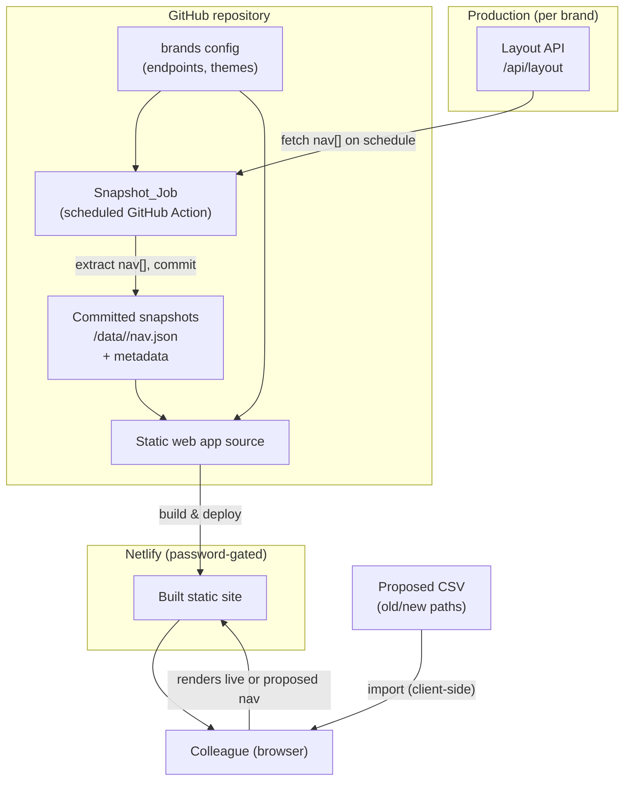

# Design Document

## Overview

The Navigation Staging Site is a small, free-to-host static web application, deployed to Netlify from a GitHub repository, that renders N Brown storefront navigation the way production renders it, one brand at a time. It exists because there is no staging environment for navigation hierarchy changes today.

There is **no comparison or diff view**. The site renders a single navigation at a time:

- On load it renders the selected brand's **live snapshot** of the production nav.
- After a colleague imports a proposed change (a CSV), it renders the **proposed** navigation, clearly flagged as such.

Navigation data originates from each brand's production layout API (for example `https://www.jdwilliams.co.uk/api/layout`). A scheduled GitHub Action extracts only the top-level `nav` array and commits it to the repository as a per-brand snapshot. The web app reads those committed snapshots — it never calls the production API from the browser, which removes any cross-origin (CORS) problem and gives a version history of nav changes for free.

The first version targets **JD Williams only**, but every brand-specific detail (endpoint, theme, label) lives in configuration so the remaining four brands are added as config entries without code changes.

### Goals

- Render a brand's live production navigation with production fidelity (Req 3).
- Snapshot the live nav for each configured brand on a schedule, storing only the `nav` array (Req 1, Req 2).
- Let a colleague import a CSV of proposed path changes and preview the resulting navigation (Req 4).
- Let a colleague choose which brand to view (Req 5).
- Host free on Netlify, gated by password (Req 6).

### Non-goals (this version)

- No side-by-side or diff comparison view (dropped by the user).
- No editing UI for building the proposed hierarchy in-browser (import is CSV only).
- No brand-switch persistence rules for imported proposals (deferred).
- No write-back to production or any production system. This is read-only staging.

## Open item to confirm before implementation

**Which path field do the CSV `old`/`new` values correspond to?** The live JSON exposes two path-like fields per node:

- `seoPath` — hierarchy-shaped, its segments mirror the node's position in the tree (e.g. `/womens/shop-by-category/dresses`).
- `urlPath` — the destination link, not hierarchy-shaped, may carry query strings (e.g. `/shop/c/womens/dresses`).

The converter positions nodes in the tree by a hierarchy-shaped path, so `seoPath` is the natural match key. The design below makes the match field an **abstracted, configurable strategy** (`pathField`) defaulting to `seoPath`, so switching to `urlPath` matching is a config change, not a rewrite. Confirmation of the field — plus a **sample CSV** — is needed to finalise the converter's add/rename defaults (see "CSV Converter" below).

## Architecture



Two independent pipelines:

1. **Data pipeline (scheduled):** GitHub Action → fetch layout API per configured brand → extract `nav` → commit `data/<brand>/nav.json` and a metadata file. A commit that changes a snapshot triggers a Netlify rebuild/redeploy so the site serves fresh data (Req 6.2).
2. **App pipeline (on demand):** the browser loads the committed snapshot for the selected brand and renders it. CSV import and conversion happen entirely client-side.

### Technology stack and rationale

- **React + TypeScript + Vite** for the web app. React/TypeScript is N Brown's frontend convention (react-typescript-conventions applies), Vite gives a fast, zero-config static build that Netlify deploys natively, and the component model suits a recursive nav renderer. The output is fully static (no server runtime), which keeps hosting free.
- **GitHub Actions** for the scheduled snapshot — free for this cadence, runs in the same repo that holds the data, and commits back with the built-in token.
- **A small, well-known CSV parser** (e.g. `papaparse`) rather than hand-rolling CSV parsing, pinned to an exact version. CSV has enough edge cases (quoting, embedded commas, BOM) that a maintained parser is safer than bespoke code.
- **Netlify** for hosting with **password protection** on the free tier, satisfying "free, safe, shareable" (Req 6).

Production fidelity is a core requirement and is addressed explicitly under "Nav Renderer and production fidelity" below.

### Repository structure

```
/
├─ .github/workflows/snapshot.yml     # Snapshot_Job (scheduled)
├─ config/
│  └─ brands.ts                        # Brand config: id, name, endpoint, theme, pathField
├─ data/
│  └─ jdwilliams/
│     ├─ nav.json                      # committed Live_Snapshot (nav array only)
│     └─ nav.meta.json                 # capture timestamp, source, status
├─ scripts/
│  └─ snapshot.ts                      # fetch + extract + write logic (invoked by the workflow)
├─ src/
│  ├─ app/                             # app shell, brand selector, mode banner
│  ├─ nav/                             # Nav Renderer (recursive) + per-brand theming
│  ├─ import/                          # CSV parsing, validation, converter
│  ├─ data/                            # snapshot loading + types
│  └─ main.tsx
├─ netlify.toml                        # build + password-protection config
└─ package.json
```

## Components and Interfaces

### 1. Brand configuration (`config/brands.ts`)

Single source of truth for which brands exist and how each is handled. Adding a brand = adding an entry (Req 1.8, Req 5, deferred brand-switch behaviour).

```ts
export interface BrandConfig {
  id: string;                 // "jdwilliams"
  name: string;               // "JD Williams"
  origin: string;             // "https://www.jdwilliams.co.uk"
  layoutPath: string;         // "/api/layout"
  themeId: string;            // key into the theme registry
  pathField: "seoPath" | "urlPath"; // converter match strategy (default "seoPath")
  enabled: boolean;           // v1: only jdwilliams = true
}

export const BRANDS: BrandConfig[] = [
  { id: "jdwilliams", name: "JD Williams", origin: "https://www.jdwilliams.co.uk",
    layoutPath: "/api/layout", themeId: "jdwilliams", pathField: "seoPath", enabled: true },
  // jacamo, simplybe, ambrosewilson, fashionworld — added later, enabled: false for now
];
```

### 2. Snapshot_Job (`.github/workflows/snapshot.yml` + `scripts/snapshot.ts`)

Scheduled GitHub Action. For each `enabled` brand (Req 1):

1. Fetch `origin + layoutPath`.
2. Parse JSON and extract **only** the top-level `nav` array — discard `header`, `footer`, `notification`, and everything else (Req 2).
3. Write `data/<brand>/nav.json` (the array) and `data/<brand>/nav.meta.json` (`capturedAt`, `source`, `status: "ok"`).
4. Commit and push changed files.

Fail-safe behaviour (Req 1.6): each brand is processed independently in a try/catch. On fetch/parse/extract failure for a brand, the job logs the error, writes/updates `nav.meta.json` with `status: "failed"` and `lastError`, and **leaves the existing `nav.json` untouched** so the last good snapshot is retained. One brand failing never blocks the others. The workflow step summary lists per-brand outcomes.

Scheduling (Req 1.5): a `cron` schedule (cadence to confirm — daily is a sensible default) plus `workflow_dispatch` for manual runs.

Security: the fetch target comes from static config, not user input. Only the `nav` array is persisted, so nothing personalised is stored (Req 2.2). The action uses the repository's built-in token with contents write scope only (least privilege).

```ts
// scripts/snapshot.ts (shape)
interface LayoutResponse { nav: NavNode[]; [key: string]: unknown; }

async function snapshotBrand(brand: BrandConfig): Promise<SnapshotResult> {
  const res = await fetch(brand.origin + brand.layoutPath, { /* timeout, UA */ });
  if (!res.ok) throw new SnapshotError(`HTTP ${res.status}`);
  const body = (await res.json()) as LayoutResponse;
  if (!Array.isArray(body.nav)) throw new SnapshotError("nav array missing");
  return { nav: body.nav, capturedAt: new Date().toISOString(), status: "ok" };
}
```

### 3. Snapshot data + loader (`src/data/`)

The committed `nav.json` files are imported/loaded by the app at build/load time. A loader exposes the selected brand's nav plus metadata to the UI, and surfaces a render-time error state if a snapshot is missing or malformed (Req 5.4).

```ts
export interface SnapshotBundle {
  brandId: string;
  nav: NavNode[];
  capturedAt: string;   // shown in the UI (Req 3.4)
  status: "ok" | "failed";
}
export function loadSnapshot(brandId: string): SnapshotBundle;
```

### 4. Nav Renderer and production fidelity (`src/nav/`)

A recursive React component that renders a `NavNode[]` as the production storefront presents it: top-level bar, expandable groups (`type: "G"`), and leaf links (`type: "L"`), to the full observed depth of three levels (Req 3.1–3.3).

Fidelity approach, stated honestly:

- **Structure and behaviour** are reproduced faithfully from the snapshot: the same grouping, nesting, ordering, labels (`title`), destinations (`urlPath`), and expand/hover interaction as the production megamenu.
- **Visual styling** is reproduced via a **per-brand theme** (colours, fonts, spacing, logo) held in a theme registry keyed by `BrandConfig.themeId`. This gets us visually close to each brand without depending on production's private CSS bundle.
- Pixel-for-pixel identity with production would require importing each brand's actual stylesheet/component library, which is brittle to couple to. The design deliberately chooses **structural fidelity + per-brand theming** as the pragmatic route, and isolates styling in the theme layer so fidelity can be tightened per brand later without touching render logic. This tradeoff is called out for reviewer attention.

```tsx
interface NavRendererProps { nodes: NavNode[]; theme: BrandTheme; mode: "live" | "proposed"; }
```

Leaf links render with their `urlPath` as `href` (Req 3.3). Because destinations are external production paths, links open against the brand origin and are treated as external navigation (not same-origin routes).

### 5. Brand selector + mode banner (`src/app/`)

- A selector lists `enabled` brands (Req 5.1). Selecting one loads and renders that brand's live snapshot (Req 5.2–5.3). In v1 only JD Williams is enabled.
- A persistent banner shows the current **mode**: "Live snapshot — captured {timestamp}" or "Proposed change — imported from {filename}" (Req 3.4, Req 4.6). The proposed state is visually distinct so no one mistakes a proposal for live.
- Brand-switch behaviour with an active proposal is **deferred**; for v1 (single enabled brand) it does not arise. The selector and state are structured so the rule can be added later without rework.

### 6. CSV import + converter (`src/import/`)

Client-side pipeline: **parse → validate → convert → render**. The uploaded CSV is untrusted input and is handled defensively throughout (Req 4.2–4.4).

```ts
export interface ProposedRow { old: string; new: string; }

export type ConversionOutcome =
  | { ok: true; nav: NavNode[]; summary: ChangeSummary }
  | { ok: false; errors: ValidationError[] };

export function parseCsv(file: File): ProposedRow[];               // via papaparse
export function validateRows(rows: ProposedRow[]): ValidationError[];
export function convert(
  live: NavNode[], rows: ProposedRow[], pathField: "seoPath" | "urlPath"
): ConversionOutcome;
```

**Parsing.** Use the pinned CSV parser. Enforce a max file size and max row count to avoid oversized-input problems. Require an `old` and a `new` column (header names case/whitespace-normalised); reject with a descriptive message if absent (Req 4.3, 4.4).

**Path normalisation.** Every `old`/`new` value is normalised before matching: trim whitespace, collapse to a single leading slash, strip trailing slash, decode percent-encoding, lower-case for comparison. This makes matching resilient to trivial formatting differences (Req 4.7).

**Match strategy (the abstracted `pathField`).** The converter builds an index of the live tree keyed by `node[pathField]`. `pathField` comes from `BrandConfig` and defaults to `seoPath`. This is the single point that changes if the confirmed CSV paths turn out to be `urlPath` values.

**Operations** (Req 4.7–4.10):

- **Remove** (`old` set, `new` empty): delete the node at the normalised `old` path; if it is a group, its subtree goes with it. If no node matches `old`, record a validation error.
- **Move / rename** (`old` and `new` both set, differ): relocate the node identified by `old` to the position implied by `new` — the parent is derived from `new`'s parent segments, and the node's own `pathField` value is updated to `new`. The node's `urlPath` destination is preserved unless the change specifically alters it.
- **Add** (`old` empty, `new` set): insert a new node at the position implied by `new`. Its parent is derived from `new`'s parent segments; if the parent does not exist, record a validation error (we do not silently fabricate intermediate groups in v1).

**Known semantic gaps to close with a sample CSV.** Deriving a brand-correct **`title`** and **`urlPath`** for a purely *added* node, and deciding **sibling order** for added/moved nodes, cannot be inferred from a path alone. v1 defaults: title = humanised last path segment; `urlPath` = the `new` path; order = appended after existing siblings (or ordered by row order among new siblings). These defaults are explicitly provisional pending the confirmed CSV shape and a real example — this is the same open item flagged above.

**Output.** On success the converter returns a new `NavNode[]` (the live tree is never mutated in place) plus a `ChangeSummary` (counts of adds/removes/moves) for display. On any validation failure it returns the collected errors and the site keeps showing the live nav with a descriptive message (Req 4.4). Converted node values are rendered through React's default escaping — no untrusted CSV value is injected as raw HTML.

## Data Models

```ts
// The production navigation node (confirmed against JD Williams /api/layout)
export interface NavNode {
  title: string;
  urlPath: string;
  type: "G" | "L";           // Group (expandable) or Leaf (link)
  seoPath: string;           // hierarchy-shaped path
  iconUrlPath?: string;
  altText?: string;          // present on some nodes
  navigationNode?: NavNode[]; // children (groups)
}

export interface SnapshotMeta {
  brandId: string;
  capturedAt: string;        // ISO 8601
  source: string;            // origin + layoutPath
  status: "ok" | "failed";
  lastError?: string;
}

export interface ChangeSummary { added: number; removed: number; moved: number; }

export interface ValidationError {
  row?: number;              // 1-based CSV row, when applicable
  code: "MISSING_COLUMN" | "EMPTY_ROW" | "OLD_NOT_FOUND"
      | "PARENT_NOT_FOUND" | "DUPLICATE_PATH" | "FILE_TOO_LARGE" | "PARSE_ERROR";
  message: string;
}
```

## Error Handling

| Area | Condition | Behaviour |
|------|-----------|-----------|
| Snapshot_Job | Brand fetch/parse/extract/commit fails | Log, mark that brand's meta `failed` + `lastError`, retain previous `nav.json`, continue other brands (Req 1.6) |
| Snapshot_Job | `nav` key missing/not an array | Treat as failure for that brand; retain previous snapshot |
| App load | Snapshot missing or malformed for selected brand | Keep brand selectable, show descriptive message instead of a broken render (Req 5.4) |
| CSV import | Missing `old`/`new` column, unparseable, too large | Reject import, show descriptive validation message, keep live nav rendered (Req 4.3, 4.4) |
| CSV convert | `old` path not found, parent missing, duplicate | Collect per-row `ValidationError`s, reject the import as a whole, report which rows failed |
| Rendering | Node missing required fields | Skip/annotate the offending node rather than crashing the whole tree |

## Security Considerations

- **No PII.** Only the public `nav` array is ever fetched, stored, or rendered; header/footer/notification and any personalised content are discarded at snapshot time (Req 2, pii-and-data baseline).
- **Access control.** The site is gated by Netlify password protection so unreleased nav plans are not publicly discoverable (Req 6.4). Note this is a shared site password, not per-user auth — acceptable given non-sensitive data and internal audience; called out for reviewer awareness.
- **Untrusted CSV.** Client-side CSV is validated, size-limited, and never rendered as raw HTML (React escaping). No CSV value is used to build a query or command.
- **Snapshot fetch target** is static config, never user input; no SSRF surface. The Action token is scoped to repo contents write only (least privilege).
- **No secrets** are required by the app or the snapshot of a public endpoint; if a brand endpoint ever needs a token, it goes in GitHub Actions secrets, never in the repo (security-baseline).

## Correctness Properties

Invariants the implementation must uphold (and that the tests above exercise):

### Property 1: Snapshot purity
A committed snapshot contains exactly the `nav` array and nothing else from the layout response. No `header`, `footer`, `notification`, or personalised content is ever persisted.
**Validates: Requirements 2.1, 2.2**

### Property 2: Fail-safe snapshots
After any Snapshot_Job run, every enabled brand still has a valid `nav.json` — either freshly captured (`status: "ok"`) or the previously good one retained (`status: "failed"`). A failure never leaves a brand with a missing or partial snapshot.
**Validates: Requirements 1.6**

### Property 3: Live tree immutability
Conversion never mutates the loaded live snapshot in memory; it always produces a new tree. Re-importing or clearing a proposal returns the exact original live render.
**Validates: Requirements 4.1, 4.5**

### Property 4: Deterministic conversion
The same live snapshot plus the same CSV always yields the same proposed tree and the same `ChangeSummary`.
**Validates: Requirements 4.1**

### Property 5: All-or-nothing import
An import either applies cleanly and renders, or is rejected with per-row errors and leaves the live nav on screen. There is no partially applied proposal.
**Validates: Requirements 4.3, 4.4**

### Property 6: Path-match consistency
Node identity and placement are determined solely by the configured `pathField`; the same normalisation is applied to both CSV values and snapshot values so matching is symmetric.
**Validates: Requirements 4.7, 4.8, 4.9, 4.10**

### Property 7: Render totality
Every node in the tree being rendered is either drawn or explicitly annotated as skipped; a single malformed node never blanks the whole navigation.
**Validates: Requirements 3.2, 5.4**

### Property 8: Mode clarity
The UI always indicates whether the current view is `live` (with capture timestamp) or `proposed` (with source filename); the two are never visually ambiguous.
**Validates: Requirements 3.4, 4.6**

### Property 9: Config-driven brands
The set of selectable brands equals the set of `enabled` brands in config, with no brand hard-coded in render logic.
**Validates: Requirements 1.8, 5.1**

## Testing Strategy

- **CSV converter (unit, highest priority):** add/remove/move/rename cases; path normalisation (slashes, casing, encoding); malformed CSV, missing columns, oversized file; `old` not found, parent not found, duplicate path; verify the live tree is not mutated. Table-driven tests with small fixture trees.
- **Snapshot script (unit):** extracts only `nav`; discards other keys; fail-safe retains previous snapshot on fetch/parse error; writes correct metadata. Fetch is mocked — tests never hit production.
- **Nav Renderer (component):** renders groups vs leaves, full three-level nesting, links carry `urlPath`, live vs proposed banner, empty/malformed snapshot message.
- **Brand config (unit):** only enabled brands are selectable; adding a config entry surfaces a new brand without code changes.
- **Fixtures:** a trimmed JD Williams `nav` sample committed as a test fixture (public data, safe to store).
- **Manual verification:** a Netlify deploy preview confirms password gating and visual fidelity per brand — the parts that can't be asserted in unit tests.

## Requirements Traceability

| Requirement | Addressed by |
|-------------|--------------|
| 1 Scheduled snapshot per configured brand | Snapshot_Job workflow + `scripts/snapshot.ts`, brand config |
| 2 Snapshot excludes non-nav/personalised | `snapshot.ts` extracts only `nav` array |
| 3 Render live nav with production fidelity | Nav Renderer + per-brand theme + timestamp banner |
| 4 Import CSV → convert → render | `src/import/` parse/validate/convert pipeline + proposed banner |
| 5 Select which brand to view | Brand selector + brand config |
| 6 Free Netlify hosting, password-gated | `netlify.toml`, Netlify password protection, rebuild on snapshot commit |

## Trust report (for the eventual MR)

- Implemented per this design: static React/TS app, scheduled snapshot Action, client-side CSV converter, per-brand config/theming, Netlify password gating.
- Provisional / needs confirmation: the CSV **path field** (`seoPath` vs `urlPath`) and the **add/rename defaults** (title, urlPath, sibling order) — finalised once a sample CSV is provided.
- Fidelity is **structural + themed**, not pixel-identical to production CSS — a deliberate tradeoff, flagged for review.
- Snapshot cadence (`cron`) is a default (daily) pending confirmation.
