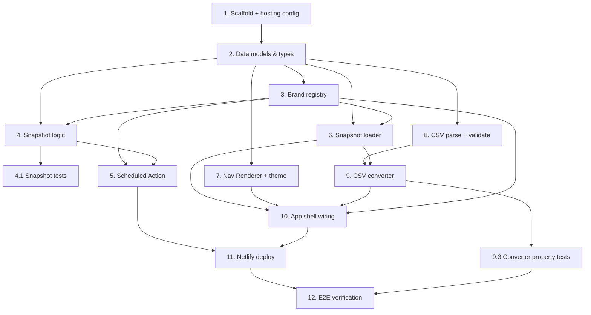

# Implementation Plan

## Overview

Scope for this plan: **JD Williams only**, with all brand-specific detail in configuration so the other four brands are added later without code changes. The CSV `pathField` defaults to `seoPath` and is abstracted; the one open item (which path field the real CSVs use, plus a sample CSV) is confirmed at task 8. Tasks are ordered so the testable core (snapshot logic, converter) is built and verified before the UI is wired, and deployment comes last.

## Tasks

- [x] 1. Scaffold the static app and hosting config
  - Initialise a Vite + React + TypeScript project with the N Brown frontend conventions (strict TS, lint, format).
  - Add `netlify.toml` with the build command, publish directory, and a placeholder for password protection (configured in the Netlify UI/secrets, not committed).
  - Add a test runner (Vitest) plus a property-based testing library (fast-check) and wire `test`, `build`, `lint` scripts.
  - Verify: `build`, `lint`, and an empty `test` run all pass.
  - _Requirements: 6.1_

- [x] 2. Define shared data models and types
  - Create `src/data/types.ts` with `NavNode`, `SnapshotMeta`, `SnapshotBundle`, `ProposedRow`, `ChangeSummary`, `ValidationError`, and `ConversionOutcome` exactly as in the design.
  - Add a trimmed JD Williams `nav` fixture (synthetic/public data) under `src/__fixtures__/` for use across tests.
  - _Requirements: 3.2, 4.1_

- [x] 3. Create configuration-driven brand registry
  - Implement `config/brands.ts` with the `BrandConfig` interface and the five brand entries; only `jdwilliams` has `enabled: true`.
  - Expose a helper that returns only enabled brands.
  - Write unit tests: only enabled brands are returned; adding an entry surfaces a new brand with no other code change.
  - _Requirements: 1.8, 5.1_
  - _Properties: 9_

- [x] 4. Implement the snapshot extraction logic (unit-testable core)
  - In `scripts/snapshot.ts`, implement `snapshotBrand` that fetches a brand's layout URL, validates that `nav` is an array, and returns only the `nav` array plus metadata.
  - Discard `header`, `footer`, `notification`, and all other keys.
  - Implement a writer that emits `data/<brand>/nav.json` and `data/<brand>/nav.meta.json`.
  - Implement fail-safe handling: on fetch/parse/extract error for a brand, mark meta `status: "failed"` with `lastError` and leave any existing `nav.json` untouched.
  - _Requirements: 1.1, 1.2, 1.3, 1.6, 1.7, 2.1, 2.2_

- [x] 4.1 Test the snapshot logic with mocked fetch
  - Unit tests (fetch mocked, never hits production): extracts only `nav`; discards other keys; writes correct metadata and timestamp.
  - Fail-safe test: a fetch/parse error retains the previous snapshot and records the failure.
  - _Requirements: 1.6, 2.1, 2.2_
  - _Properties: 1, 2_

- [x] 5. Create the scheduled GitHub Action
  - Add `.github/workflows/snapshot.yml` with a `cron` schedule (daily default) and `workflow_dispatch`.
  - Iterate enabled brands, invoke the snapshot script per brand independently, commit changed files with the built-in token (contents write only), and write a per-brand outcome to the step summary.
  - _Requirements: 1.4, 1.5, 6.2_

- [x] 6. Implement the snapshot loader
  - Implement `loadSnapshot(brandId)` in `src/data/` that reads the committed `nav.json` + `nav.meta.json` and returns a `SnapshotBundle`.
  - Return a clear error state when a snapshot is missing or malformed (do not throw into the render tree).
  - Unit tests for ok, missing, and malformed snapshots.
  - _Requirements: 3.4, 5.2, 5.4_

- [x] 7. Build the Nav Renderer with per-brand theming
  - [x] 7.1 Implement the recursive renderer
    - Render `type: "G"` as expandable groups and `type: "L"` as leaf links carrying `urlPath` as `href`, to full three-level nesting.
    - Render totality: skip/annotate a malformed node without blanking the tree.
    - Accept a `mode` prop (`live` | `proposed`).
    - Component tests: groups vs leaves, three-level nesting, links present, malformed node handled.
    - _Requirements: 3.1, 3.2, 3.3_
    - _Properties: 7_
  - [x] 7.2 Add the JD Williams theme
    - Implement a theme registry keyed by `themeId`; add the JD Williams theme (colours, fonts, spacing, logo) approximating the production megamenu presentation.
    - Isolate all brand styling in the theme layer so fidelity can be tightened later per brand.
    - _Requirements: 3.1_

- [x] 8. Confirm CSV path field, then implement parse + validate
  - Confirm with the user which field `old`/`new` map to (`seoPath` vs `urlPath`) and obtain a sample CSV; set `pathField` in config accordingly (default `seoPath`).
  - Implement `parseCsv` using the pinned CSV parser with a max file size and row-count guard.
  - Implement `validateRows`: require `old`/`new` columns (header names normalised), flag empty rows; return descriptive `ValidationError`s.
  - Unit tests: valid CSV, missing columns, unparseable content, oversized file.
  - _Requirements: 4.2, 4.3, 4.4_

- [x] 9. Implement the CSV → navigation converter
  - [x] 9.1 Path normalisation and tree indexing
    - Normalise paths (trim, single leading slash, no trailing slash, decode, case-fold for comparison); apply identically to CSV values and snapshot values.
    - Build an index of the live tree keyed by `node[pathField]`.
    - _Requirements: 4.7_
    - _Properties: 6_
  - [x] 9.2 Apply add / remove / move-rename operations
    - Implement remove (empty `new`), add (empty `old`), and move/rename (both differ), producing a new tree without mutating the live snapshot.
    - Apply the provisional add/rename defaults from the design (title from last segment, `urlPath` = new path, sibling order appended) — revisit against the sample CSV.
    - Collect per-row errors (`OLD_NOT_FOUND`, `PARENT_NOT_FOUND`, `DUPLICATE_PATH`); reject the whole import if any occur.
    - Return `ConversionOutcome` with the new tree and `ChangeSummary` on success.
    - _Requirements: 4.1, 4.4, 4.8, 4.9, 4.10_
    - _Properties: 3, 4, 5_
  - [x] 9.3 Property-based tests for the converter
    - **Live tree immutability** (Property 3): after any conversion, the input live tree is deep-equal to its original.
    - **Determinism** (Property 4): same inputs produce an identical output tree and summary across repeated runs.
    - **All-or-nothing** (Property 5): any invalid row yields `ok: false` and no partial tree.
    - **Path-match consistency** (Property 6): matching is invariant to slash/case/encoding differences.
    - Generate randomised small trees and row sets with fast-check.
    - _Requirements: 4.4, 4.7, 4.8, 4.9, 4.10_
    - _Properties: 3, 4, 5, 6_

- [x] 10. Wire the app shell: brand selector, import, mode banner
  - Brand selector listing enabled brands; selecting one loads and renders that brand's live snapshot.
  - CSV import control; on success render the proposed tree, on failure show descriptive validation messages and keep the live nav on screen.
  - Persistent mode banner: "Live snapshot — captured {timestamp}" or "Proposed change — imported from {filename}", visually distinct.
  - Render converted values via React escaping only (no raw HTML injection).
  - Component tests: live render on load, timestamp shown, successful import switches to proposed + banner, failed import keeps live + shows errors.
  - _Requirements: 3.4, 4.5, 4.6, 5.2, 5.3, 5.4_
  - _Properties: 8_

- [ ] 11. Deploy to Netlify with password protection
  - Connect the GitHub repo to Netlify, confirm the static build deploys, and enable site-level password protection.
  - Verify a snapshot commit triggers a rebuild that serves updated data, and that the site is reachable only with the shared credential.
  - _Requirements: 6.1, 6.2, 6.3, 6.4_

- [ ] 12. End-to-end verification pass
  - Run full `build`, `lint`, and `test` (including property-based tests).
  - Manually verify on a Netlify deploy preview: JD Williams live nav renders with production-like fidelity, a sample CSV import renders as proposed, and password gating works.
  - Note in the MR trust report what was verified manually vs by tests, and the outstanding fidelity/CSV-default assumptions.
  - _Requirements: 3.1, 4.5, 6.4_

## Task Dependency Graph



```json
{
  "waves": [
    { "wave": 1, "tasks": ["1"] },
    { "wave": 2, "tasks": ["2"] },
    { "wave": 3, "tasks": ["3", "7", "8"] },
    { "wave": 4, "tasks": ["4", "6"] },
    { "wave": 5, "tasks": ["4.1", "5", "9"] },
    { "wave": 6, "tasks": ["9.3", "10"] },
    { "wave": 7, "tasks": ["11"] },
    { "wave": 8, "tasks": ["12"] }
  ]
}
```

## Notes

- **Open item (blocks task 8+ finalisation):** confirm whether CSV `old`/`new` values are `seoPath` or `urlPath`, and provide a sample CSV. The converter is built against `seoPath` by default with `pathField` abstracted, so this is a config change plus revisiting the add/rename defaults, not a rewrite.
- **Fidelity is structural + per-brand theming**, not pixel-identical to production CSS — a deliberate tradeoff isolated in the theme layer (task 7.2) so it can be tightened per brand later.
- **Brand-switch persistence** of an imported proposal is deferred; it does not arise in v1 with a single enabled brand.
- **Data safety:** only the public `nav` array is ever fetched or stored; no customer PII is involved. Netlify password gating (task 11) is a shared credential, not per-user auth.
- Human-approved deploy: task 11 connects Netlify and enables gating; do not automate production/live changes without a human in the loop.
